# 🚀 NeuroCompute – Enterprise Cloud Computing Platform

<div align="center">

### Secure • Scalable • Automated • Monitored

[]()
[]()
[]()
[]()
[]()
[]()
[]()

</div>

---

## 🚀 Live Demo

| Resource | Link |
|-----------|--------|
| 🌐 Live Application | 🚀 Live Demo: Available on request / Local environment demonstration |
| 📄 Documentation | [View Documentation](https://docs.google.com/document/d/1tR_-45rCkCp58_c0MmpDdHVJc_DYIuPgB09cC_EmoDs/edit?usp=sharing) |

---

# 📌 Project Overview

NeuroCompute is an Enterprise Cloud Computing Platform designed to demonstrate a complete Full-Stack DevOps ecosystem.

The platform enables secure user authentication, cloud resource management, job application workflows, monitoring, logging, infrastructure automation, and containerized deployment using modern DevOps practices.

---
### 🏗️ System Architecture

<p align="center">
  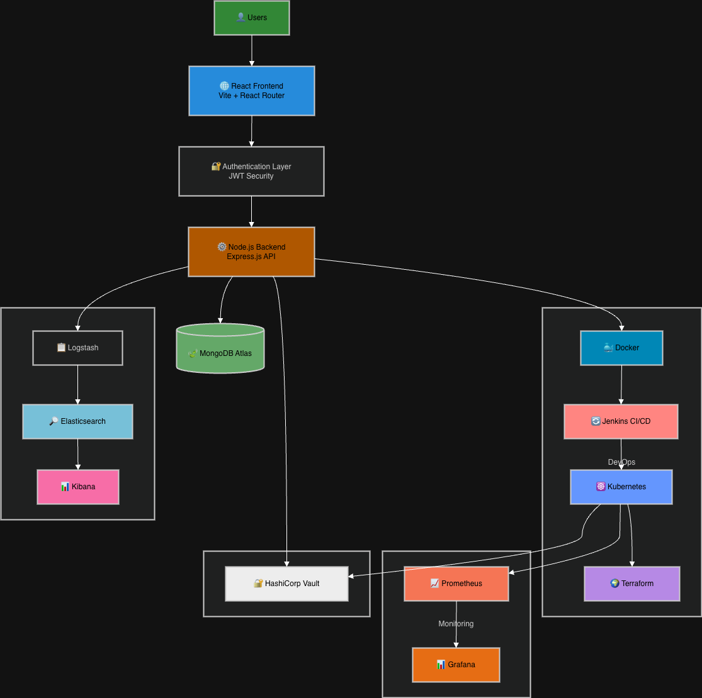
</p>

---

# 📷 Application Screenshots

## 🔐 Login Page (Dark Mode)

<p align="center">
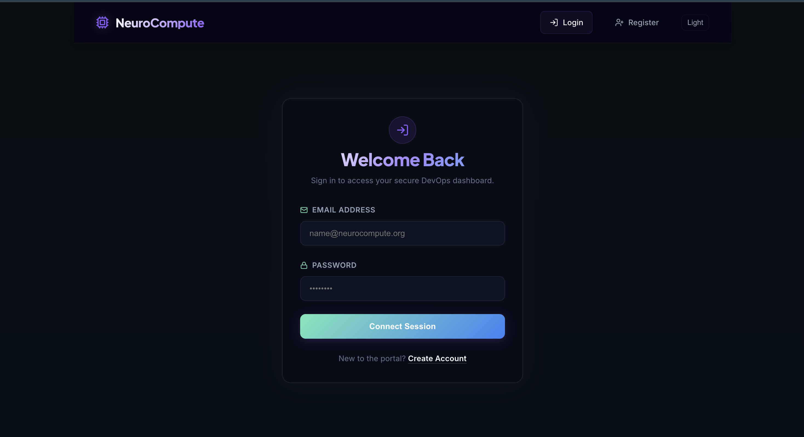
</p>

---

## ☀️ Login Page (Light Mode)

<p align="center">
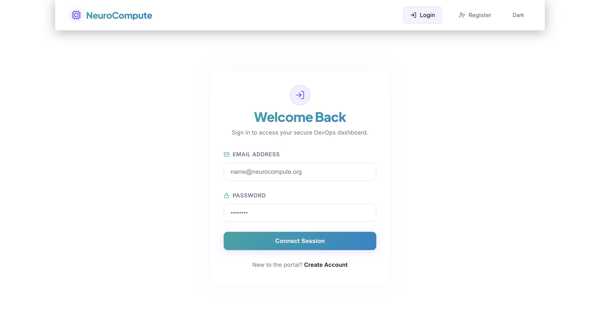
</p>

---

## 👤 Create Account

<p align="center">
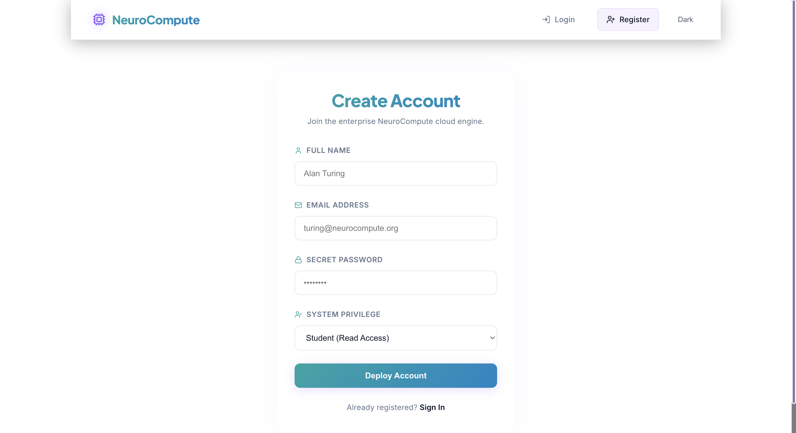
</p>

---

## 📊 Dashboard

<p align="center">
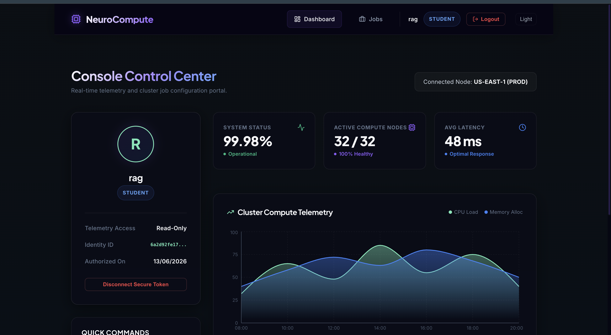
</p>

---

## 📈 Analytics Dashboard

<p align="center">
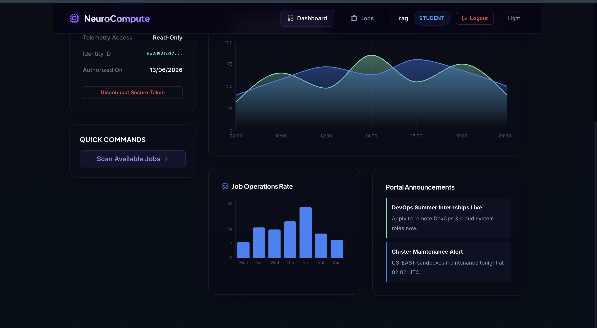
</p>

---

## 💼 Jobs Page

<p align="center">
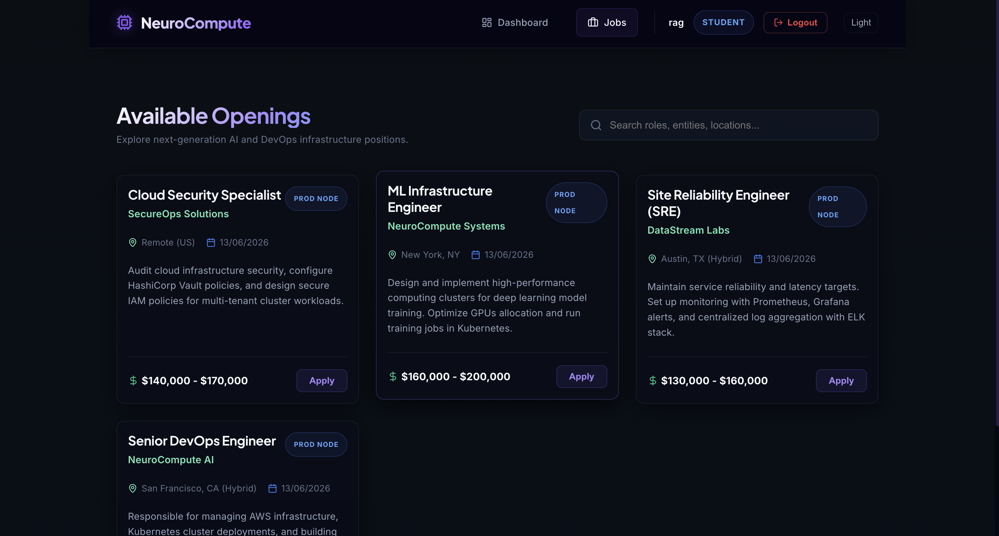
</p>

---

## 🐳 Docker Containers

<p align="center">
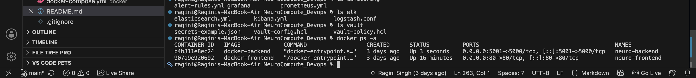
</p>

---

## 🚀 Jenkins Pipeline

<p align="center">
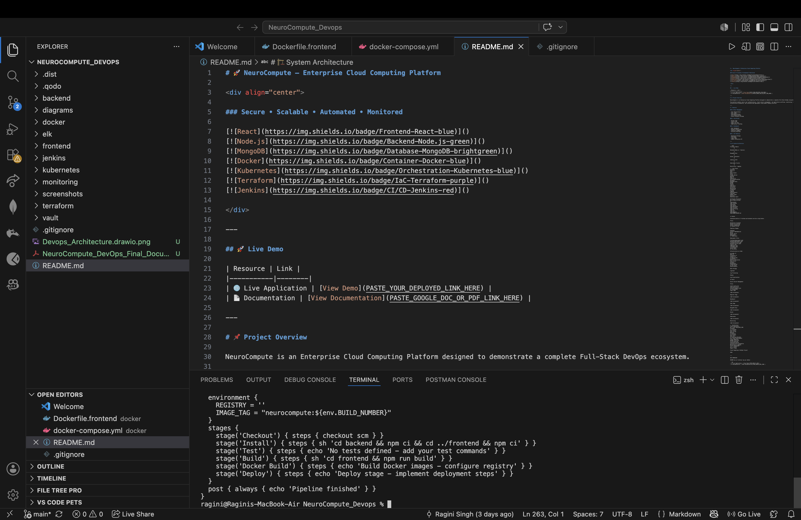
</p>

---

## 📈 Prometheus

<p align="center">
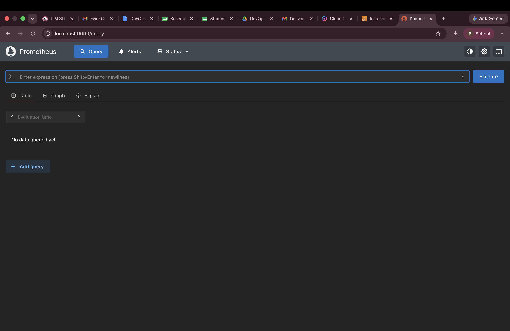
</p>

---

## 📊 Grafana Login

<p align="center">
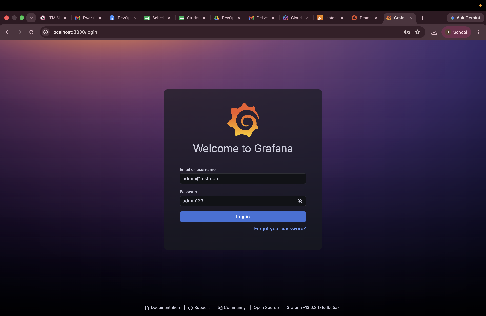
</p>

---

## 📊 Grafana Home

<p align="center">
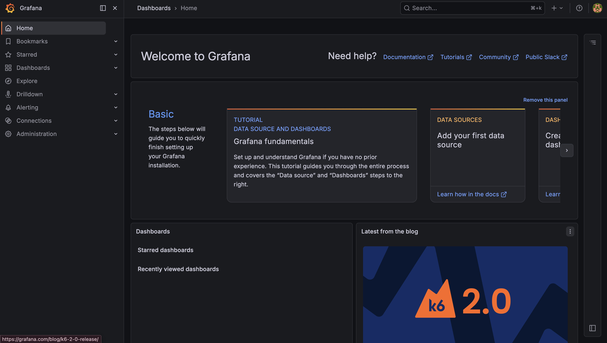
</p>

---

## 📊 Grafana Dashboard

<p align="center">
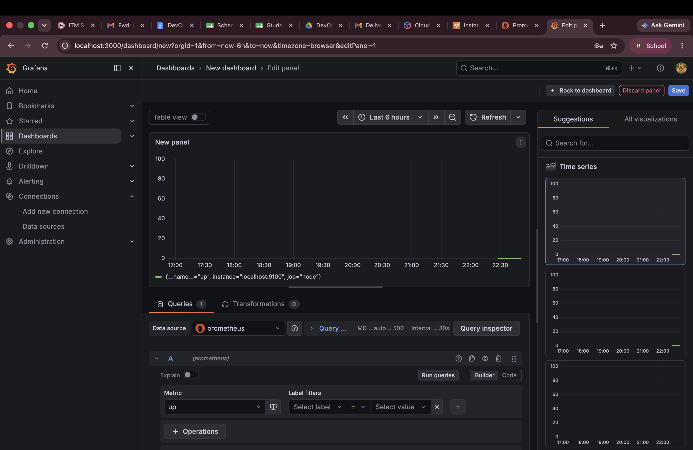
</p>

---

## ☸ Kubernetes Deployment

<p align="center">

</p>

---

## 🌍 Terraform Validation

<p align="center">
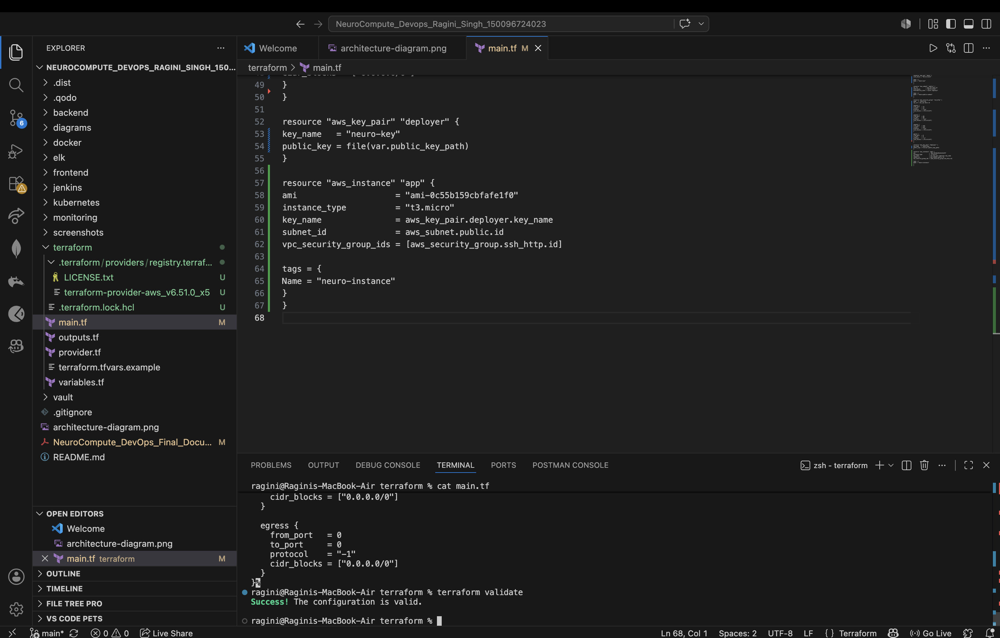
</p>

---

## 🔐 Vault

<p align="center">
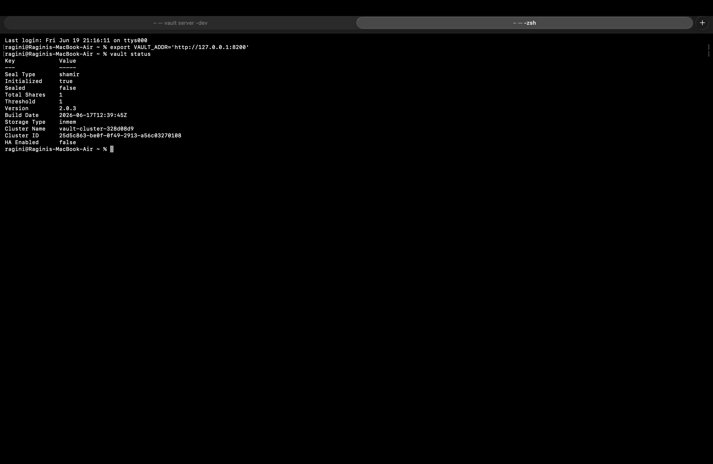
</p>
---


## 🐳 Docker Installation

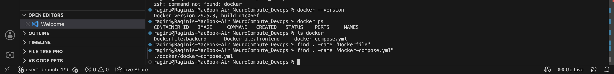

---

## ⚙️ Docker Configuration Files


---

## 🛠️ Development Environment

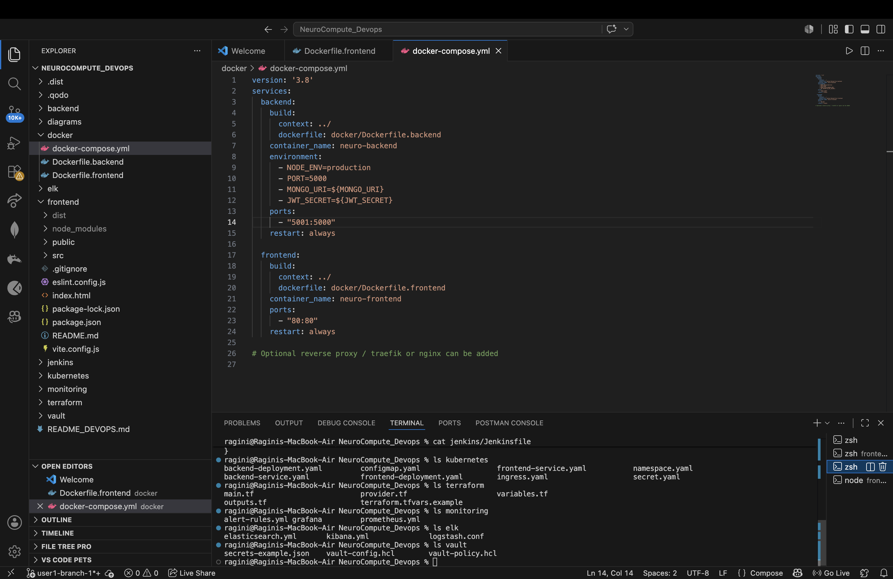

## 🚀 Jenkins Pipeline Configuration

<p align="center">
  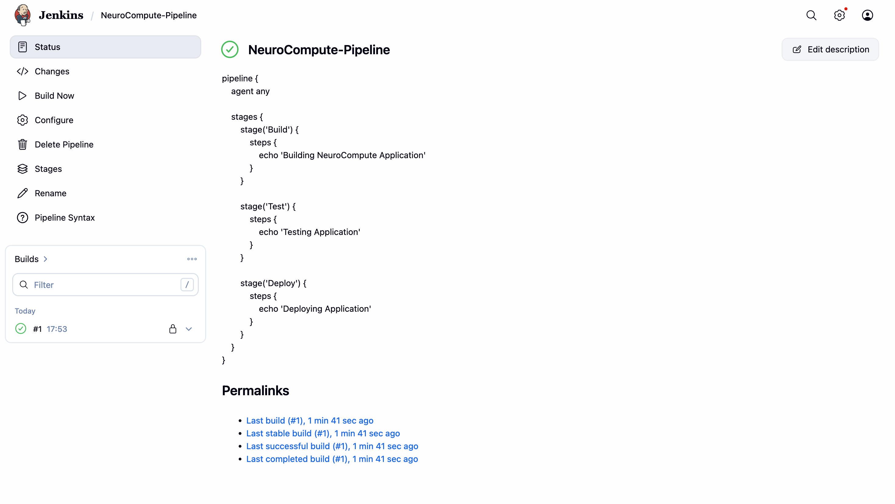
</p>

# ✨ Features

---

## 👤 User Management

- User Registration
- User Login
- JWT Authentication
- Secure Password Storage
- Session Management
- Role-Based Access Control

---

## 💼 Job Portal

- Browse Available Jobs
- Search Jobs
- Apply for Jobs
- Track Applications
- Job Recommendations
- Job Management System

---

## 📊 Dashboard

- User Dashboard
- Application Statistics
- Activity Tracking
- Resource Monitoring
- Performance Insights
- Real-Time Updates

---

## 🎨 User Experience

- Responsive Design
- Modern UI/UX
- Dark Theme Interface
- Smooth Navigation
- Interactive Components
- Mobile Friendly Layout

---

## 🐳 Docker Containerization

- Frontend Container
- Backend Container
- Docker Compose Integration
- Multi-Container Deployment
- Environment Isolation
- Consistent Runtime Environment

---

## 🔄 Jenkins CI/CD Pipeline

- Automated Build Process
- Dependency Installation
- Continuous Integration
- Automated Deployment Workflow
- Docker Image Build
- Pipeline Automation

---

## ☸️ Kubernetes Orchestration

- Frontend Deployment
- Backend Deployment
- Service Configuration
- Ingress Routing
- Namespace Management
- ConfigMap & Secret Management

---

## 🌍 Infrastructure as Code

- Terraform Configuration
- Automated Resource Provisioning
- Infrastructure Management
- Cloud Deployment Automation
- Reusable Infrastructure Templates

---

## 📈 Monitoring & Observability

### Prometheus

- Metrics Collection
- Performance Monitoring
- Alert Rules
- System Health Tracking

### Grafana

- Interactive Dashboards
- Visualization Reports
- Monitoring Analytics
- Resource Usage Insights

---

## 📋 Centralized Logging

### ELK Stack

#### Elasticsearch

- Log Storage
- Data Indexing

#### Logstash

- Log Processing
- Data Transformation

#### Kibana

- Log Visualization
- Search & Analysis

---

## 🔐 Security & Secrets Management

### HashiCorp Vault

- Secret Storage
- Credential Management
- Secure Configuration
- Access Control Policies

---

## 🚀 DevOps Practices

- Containerization
- CI/CD Automation
- Infrastructure Automation
- Monitoring & Alerting
- Centralized Logging
- Secret Management
- Cloud-Native Architecture

---


# 🏗️ System Architecture

```text
Frontend (React)
       │
       ▼
Backend (Node.js + Express)
       │
       ▼
MongoDB Atlas
       │
       ▼
Docker Containers
       │
       ▼
Jenkins CI/CD
       │
       ▼
Kubernetes Cluster
       │
       ▼
Monitoring + Logging
```

---
## 🛠️ Tech Stack

### Frontend
- React.js
- Vite
- React Router
- Axios
- Framer Motion

### Backend
- Node.js
- Express.js
- JWT Authentication

### Database
- MongoDB Atlas

### DevOps
- Docker
- Jenkins
- Kubernetes
- Terraform

### Monitoring
- Prometheus
- Grafana

### Logging
- Elasticsearch
- Logstash
- Kibana (ELK)

### Security
- HashiCorp Vault

---

## 📂 Project Structure

```text
NeuroCompute_Devops
│
├── backend
├── frontend
├── docker
├── jenkins
├── kubernetes
├── terraform
├── monitoring
├── elk
├── vault
├── diagrams
├── screenshots
└── README.md
```

---

## 🐳 Docker

Containerization of frontend and backend services.

### Files

- Dockerfile.frontend
- Dockerfile.backend
- docker-compose.yml

---

## 🔄 Jenkins CI/CD

### Pipeline Stages

1. Checkout Source Code
2. Install Dependencies
3. Build Application
4. Docker Image Build
5. Deployment

---

## ☸️ Kubernetes

### Deployment Files

- frontend-deployment.yaml
- backend-deployment.yaml
- frontend-service.yaml
- backend-service.yaml
- ingress.yaml
- namespace.yaml
- configmap.yaml
- secret.yaml

---

## 🌍 Terraform

### Infrastructure as Code

- provider.tf
- main.tf
- variables.tf
- outputs.tf

---

## 📈 Monitoring

### Prometheus

- Metrics Collection
- Alert Rules
- Application Monitoring

### Grafana

- Dashboard Visualization
- Performance Monitoring

---

## 📋 ELK Stack

### Elasticsearch

- Log Storage

### Logstash

- Log Processing

### Kibana

- Log Visualization

---

## 🔐 Vault

### Secret Management

Files:

- vault-config.hcl
- vault-policy.hcl
- secrets-example.json

---

## 📷 Screenshots

All project screenshots are available inside the **screenshots/** directory.

### Included Screenshots

- Login Page
- Registration Page
- Dashboard
- Job Search Page
- MongoDB Atlas Setup
- Docker Setup
- Kubernetes Setup
- Monitoring Dashboard

---
## 🚀 Installation

### Clone Repository

```bash
git clone https://github.com/RaginiSingh2024/NeuroCompute-DevOps.git
```

### Frontend Setup

```bash
cd frontend
npm install
npm run dev
```

### Backend Setup

```bash
cd backend
npm install
npm start
```

### Docker Setup

```bash
docker compose -f docker/docker-compose.yml up --build
```

---

## 📚 Learning Outcomes

- Full Stack Development
- Cloud Computing
- DevOps Engineering
- Docker Containerization
- CI/CD Automation
- Kubernetes Orchestration
- Infrastructure Automation
- Monitoring & Logging
- Secret Management

---


# 👩‍💻 Author
Ragini Singh

Cloud Computing & DevOps Project

Problem Statement No : 118

Problem Statement Title : NeuroCompute – Enterprise Cloud Computing Platform

2026


---


⭐ If you found this project useful, please consider giving it a star.


